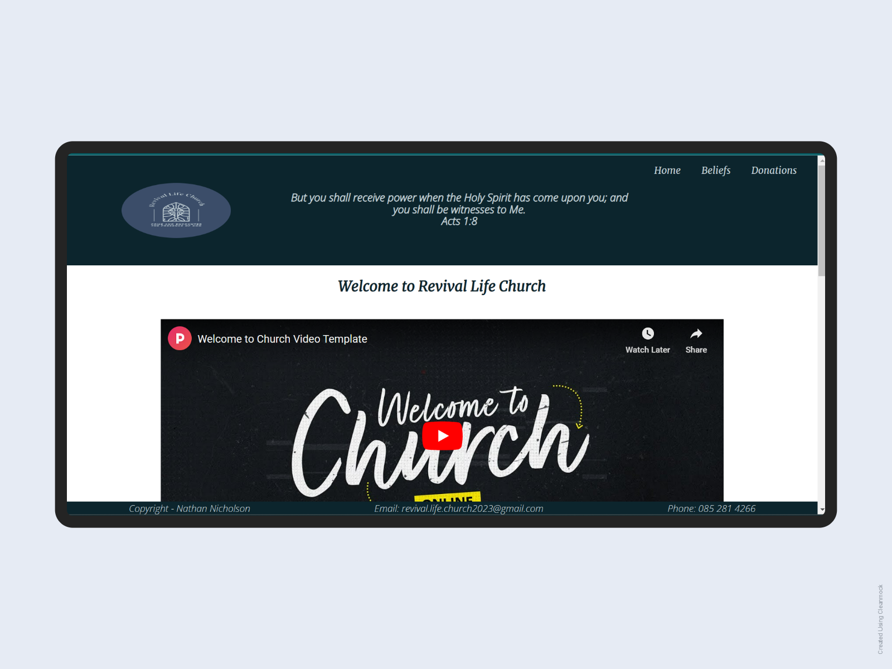

# Welcome to Revival Life Church

Revival Life Church is a site of a Penetcostal Christian ministry based in Tullamore, County Offaly. It will target church goers but also is inclusive to all people. Revival Life Church will be useful for those searching for the church service-times, location, contact information, doctrinal beliefs, and more.

## Features

- Home Page
- Beliefs Page
- Donations Page
- Footer
- Navigation Bar
- Google Maps Address Link
- Video Controls
- Prayer Request Form
- Church Logo link to download app
- Social Media Icons
- Cross Icon to other website
- Donations Form

### Home Page

- This feature is the landing page of the website. The header consists of a church logo, bible verse and nav bar.

- Below the greeting of the church is a video to give context of kind of faith community Revival Life Church is.



- It also has an About Us section to further give context to the user of the websites purpose. Beside the About Us text is an image of church goers.

.png)

- It features a display for the church service times and location to give the user the invitation to join a service in person. 

### Beliefs Page

- This feature is a layout similar to the Home page for web design integrity. The differences are within the main section. Changes are made with a different video, content text and image.


- This page is to allow the user a feel of what the church faith and practices are. This will help the user quickly make a decision if they believe the same or not.

.png)


### Donations Page

- This feature is give payment options to the user if they chose to make a donation to the church.

.png)

### Footer

- This feature displays my copyright name as the webiste's author.

- It also includes the church email and phone number. This is a fixed footer and can be viewed immediately upon landing on the website and also throughout the user's entire experience on the website. This is done to ensure the user has the vital contact infomation right away or whenever needed.

### Navigation Bar
- Featured on all three pages, the full responsive navigation bar includes links to the Home page, Beliefs and Donations page and is identical in each page to allow for easy navigation.

- This section will allow the user to easily navigate from page to page across all devices without having to revert back to the previous page via the ‘back’ button.

.png)

### Google Maps Address
- Featured on the Home page, Beliefs page and on the Thank You page (when directed from filling out a donations form) to direct the user to Google Maps.

- This feature will allow the user to idenify the church location and use the features availbale there such as GPS during car drives to the church.

*Note - Not actual church address giving as this site is done as a potential template.

### Video Controls
- Featured on the Home page and Beliefs page to give a further contect on the pages' content. This allows the user to press play, pause, make the video full-screen, adjust the volume, or quite simply not play the video at all.

### Prayer Request Form
- Featured on the Home page and Beliefs page to allow the user to fill out a prayer request.

- This is a vital way of allowing people to feel like their needs are cared for. It can also be used as a follow up form of communication from the church to the user.

.png)

### Church Logo link to app
- Featured on the Home page and Beliefs page to allow the user to download the church app. It is an image of the church logo within an anchor element to redirect to Google Playstore.

- This would allow the user more updated notifcations of church events, ways of communication, involvement, etc.

.png)

*Note - There is no actual church mobile app developed. This is done to show way potenital features can be included. This is something I plan to get into in the future that is, mobile app development.

### Social Media Icons
- Featured on the Home page and Beliefs page to allow the user to connect to the church social media platforms such as Facebook, Instagram and Twitter.

- Having social media websites availbale would communicate to any user that the church is modern, relevant and desirable.

*Note - Not actual social media accounts for the church were created. This is done for potenital purposes and the display of I know how.

### Cross Icon to other website

- Featured on the Beliefs page only under the summary of beliefs text section. 

- This is to direct the user to the offical statment of beliefs to further explain what doctrine the church holds dear to.

### Donations Form
- Featured on the Donations page only as the main content.

- This is to allow the user an ease of payment, as this is a regular service provided on official church websites globally. 

*Note - If time permitted, I would have set up a Paypal, Google Pay and Apple system of payment.

### Features left to implenment

- To give the user a link to a bible app download
- To give the user access to worship music playlist
- To give the user an events page with the option to select and book via a calandar
- To give the user the option to book a pastor for some one to one council.
- To give the user the option to sign up to partake in an outreach, such as feeding the homeless.
- To give the user an actual church mobile app to download.


## Running Tests

### W3C Validator (HTML)

- When I ran this validator I discovered eleven minor errors with my HTML code. Below are some screenshots of that test.

.png)
.png)
.png)
.png)

- Now the code is corrected and validated.

.png)


### Jigsaw Validator (CSS)

- When I ran this validator I discovered two mionor errors with my CSS code. Below is a screenshot of that test.

.png)

- Now the code is corrected and validated.

.png)

## Credits

### Design

- Color Theme
.png)

These are the two primary colors I used along with the static white. Thanks to Coolors for this screenshot.

- Wireframes
.png)
.png)
.png)
.png)

As you can see above that I set out to do the website in a certain way, but as things developed I changed the content display around some. Thanks to Balsamiq for starting me with an end view in mind.

- Typography

The two font-families I used for my website are 'Merriweather' and 'Open Sans'. These two compliment each other well. Thanks to Google Fonts I found this match.


### Media

- Canva

My project's church logo came from Canva, where I could personalise an image I found.

- YouTube

The two videos are credited from YouTube. I do not own the rights to any.

- Shutterstock

The rest of the images found on my website are credited to Shutterstock's fine resolution.

## Deployment

The site was deployed to GitHub pages. The steps to deploy are as follows:
In the GitHub repository, navigate to the Settings tab
From the source section drop-down menu, select the Master Branch
Once the master branch has been selected, the page will be automatically refreshed with a detailed ribbon display to indicate the successful deployment.
The live link can be found here
```https://nathan-bytecode.github.io/PP1/


### Tech Stack

**Languages:** HTML5, CSS3.

**IDE:** Gitpod, Github, then migrated onto Codeanywhere which also has VS Studio installed.

**Images:** Canva, Shutterstock, Mockup, Freepik.

**Videos:** YouTube.

**Font-family:** Google Fonts.

**Icons:** Font Awesome.

**Wireframes:** Balsamiq.

**Other Tools:** Google Dev Tools.

---

A big thanks to Code Institue for teaching me how to build my own website throough HTML and CSS. I also want to acknowledge my class mate Benji for showing me the great benefits of Google's dev.tool. 
